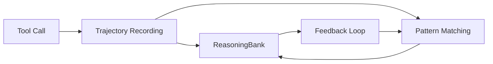

# SONA-light: OpenFlo Self-Learning System

## Что такое SONA-light

SONA (Self-Organizing Neural Architecture) — концепция ruflo для адаптивного обучения агента.
OpenFlo реализует **SONA-light**: упрощённую версию без LoRA adapters, EWC++ и MoE.

## Что входит в SONA-light

| Компонент | Описание | Статус |
|-----------|----------|--------|
| Trajectory Recording | Запись цепочек tool call'ов и их результатов | ✅ T5.1 |
| Pattern Matching (MMR) | MMR (Maximum Marginal Relevance) поиск похожих паттернов | ✅ T5.2 |
| ReasoningBank | Хранилище рассуждений: проблема → решение → outcome | ✅ T5.3 |
| Feedback Loop | Обучение на успешных/неуспешных исходах | ✅ T5.4 |

## Что НЕ входит (требует full SONA)

- **LoRA adapters** — дообучение модели на успешных траекториях
- **EWC++ (Elastic Weight Consolidation)** — защита от катастрофического забывания
- **MoE (Mixture of Experts)** — динамический выбор sub-модели
- **Flash Attention** — оптимизация внимания

Когда может быть добавлен full SONA: Phase Future (после Federation и Web UI)

## Архитектура

## Принципы

1. **Implicit > Explicit** — обучение происходит без участия пользователя
2. **Positive reinforcement** — успешные паттерны усиливаются
3. **Decay** — старые/неудачные паттерны теряют вес
4. **Privacy** — ReasoningBank не хранит сырые данные, только обобщения
